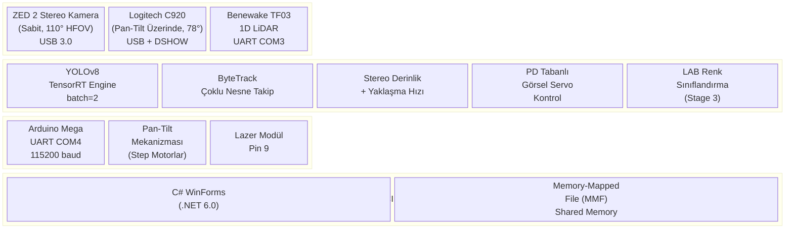
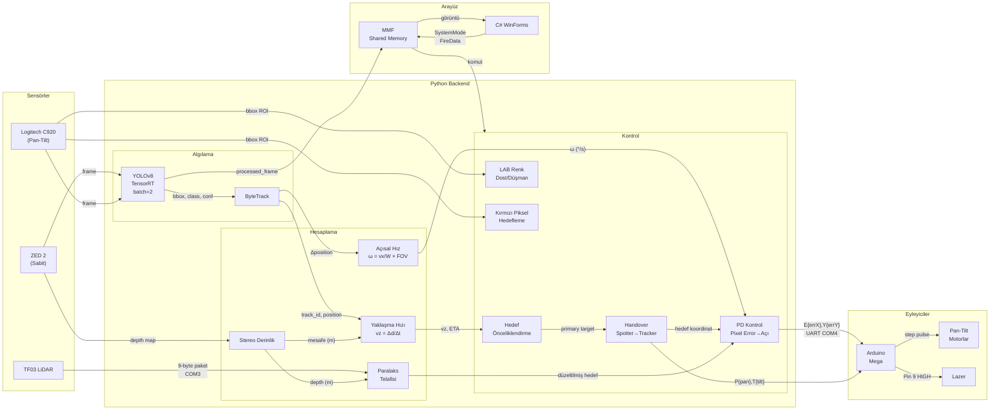

# Sistem Blok Diyagramı



---

## Veri Akış Blok Diyagramı



---

## Donanım Bağlantı Blok Diyagramı

```mermaid
flowchart TB
    subgraph PC["Bilgisayar (GPU + CPU)"]
        PY["Python Backend"]
        CS["C# WinForms UI"]
        PY <-- "MMF\nShared Memory" --> CS
    end

    subgraph TRIPOD["Sabit Tripod"]
        ZED["ZED 2\nStereo Kamera"]
    end

    subgraph PANTILT["Pan-Tilt Mekanizması"]
        LOG["Logitech C920"]
        LAS["Lazer Modül"]
        LID["TF03 LiDAR"]
    end

    ARD["Arduino Mega"]

    ZED -- "USB 3.0" --> PC
    LOG -- "USB 2.0" --> PC
    LID -- "UART COM3\n115200 baud" --> PC
    ARD -- "UART COM4\n115200 baud" --> PC
    ARD -- "Step/Dir\nPin 2,3,5,6" --> PANTILT
    ARD -- "Pin 9" --> LAS
