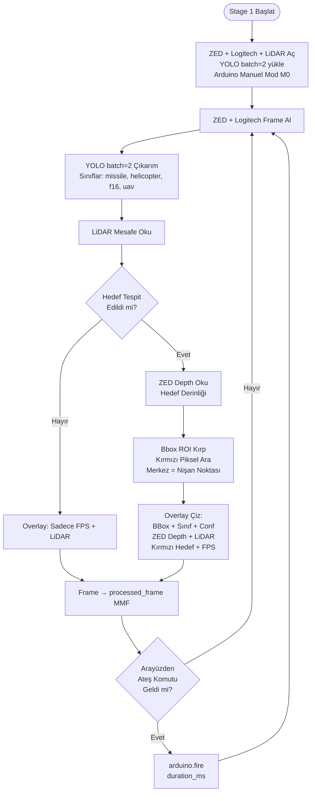
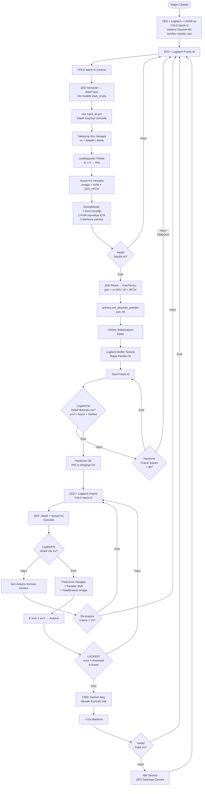
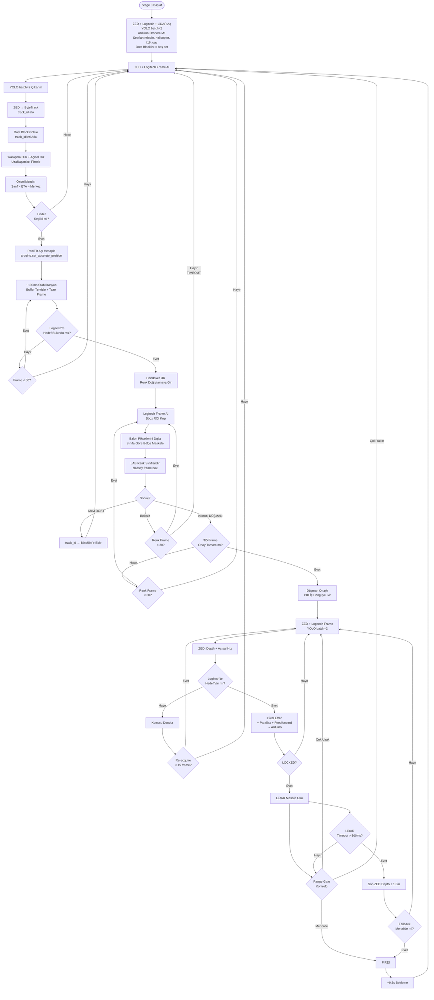

# Akış Diyagramları — Güncel (v5)

## Stage 1 — Manuel Mod

```mermaid
flowchart TD
    S1_START([Stage 1 Başlat]) --> S1_INIT[ZED + Logitech + LiDAR Aç\nYOLO batch=2 yükle\nArduino Manuel Mod M0]
    S1_INIT --> S1_GRAB[ZED + Logitech Frame Al]
    S1_GRAB --> S1_YOLO[YOLO batch=2 Çıkarım\nSınıflar: missile, helicopter, f16, uav]
    S1_YOLO --> S1_LIDAR[LiDAR Mesafe Oku]
    S1_LIDAR --> S1_DET{Hedef Tespit\nEdildi mi?}

    S1_DET -- Hayır --> S1_OVR_EMPTY[Overlay: Sadece FPS + LiDAR]
    S1_OVR_EMPTY --> S1_MMF

    S1_DET -- Evet --> S1_DEPTH[ZED Depth Oku\nHedef Derinliği]
    S1_DEPTH --> S1_RED[Bbox ROI Kırp\nKırmızı Piksel Ara\nMerkez = Nişan Noktası]
    S1_RED --> S1_OVR[Overlay Çiz:\nBBox + Sınıf + Conf\nZED Depth + LiDAR\nKırmızı Hedef + FPS]
    S1_OVR --> S1_MMF

    S1_MMF[Frame → processed_frame MMF] --> S1_FIRE{Arayüzden\nAteş Komutu\nGeldi mi?}
    S1_FIRE -- Hayır --> S1_GRAB
    S1_FIRE -- Evet --> S1_SHOOT[arduino.fire\nduration_ms]
    S1_SHOOT --> S1_GRAB
```

---

## Stage 2 — Otonom Swarm (3 Kol, Mesafe Kontrolü Yok)

```mermaid
flowchart TD
    S2_START([Stage 2 Başlat]) --> S2_INIT[ZED + Logitech + LiDAR Aç\nYOLO batch=2\nArduino Otonom M1\nSınıflar: missile, uav]

    %% === DIŞ DÖNGÜ: SPOTTER ===
    S2_INIT --> S2_GRAB[ZED + Logitech Frame Al]
    S2_GRAB --> S2_YOLO[YOLO batch=2 Çıkarım]
    S2_YOLO --> S2_BT[ZED Sonuçları → ByteTrack\nHer hedefe track_id ata]
    S2_BT --> S2_DEPTH_H[Her track_id için\nDepth Geçmişi Güncelle]
    S2_DEPTH_H --> S2_VZ[Yaklaşma Hızı Hesapla\nvz = Δdepth / Δtime]
    S2_VZ --> S2_FILTER[Uzaklaşanları Filtrele\nvz < 0 → Atla]
    S2_FILTER --> S2_OMEGA[Açısal Hız Hesapla\nomega = vx/W × ZED_HFOV]
    S2_OMEGA --> S2_PRIO[Önceliklendir:\n1 Sınıf önceliği\n2 Kritik mesafeye ETA\n3 Merkeze yakınlık]
    S2_PRIO --> S2_SEL{Hedef\nSeçildi mi?}
    S2_SEL -- Hayır --> S2_GRAB

    %% === HANDOVER ===
    S2_SEL -- Evet --> S2_ANG[ZED Piksel → Pan/Tilt Açı\npan = cx-W/2 / W × HFOV]
    S2_ANG --> S2_SLEW[arduino.set_absolute_position\npan, tilt]
    S2_SLEW --> S2_WAIT[~100ms Stabilizasyon Bekle]
    S2_WAIT --> S2_FLUSH[Logitech Buffer Temizle\nBayat Kareleri At]
    S2_FLUSH --> S2_FRESH[Taze Frame Al]
    S2_FRESH --> S2_MATCH{Logitech'te\nHedef Bulundu mu?\nsınıf + boyut + merkez}
    S2_MATCH -- Hayır --> S2_HO_CNT{Handover\nFrame Sayacı\n< 30?}
    S2_HO_CNT -- Evet --> S2_FRESH
    S2_HO_CNT -- Hayır\nTIMEOUT --> S2_GRAB
    S2_MATCH -- Evet --> S2_PID_START[Handover OK\nPID İç Döngüye Gir]

    %% === İÇ DÖNGÜ: PID ===
    S2_PID_START --> S2_PID_GRAB[ZED + Logitech Frame\nYOLO batch=2]
    S2_PID_GRAB --> S2_PID_ZED[ZED: Depth + Açısal Hız\nGüncelle]
    S2_PID_ZED --> S2_PID_CHK{Logitech'te\nHedef Var mı?}

    S2_PID_CHK -- Hayır --> S2_FREEZE[Son Arduino Komutu Dondur]
    S2_FREEZE --> S2_REACQ{Re-acquire\nFrame < 15?}
    S2_REACQ -- Evet --> S2_PID_GRAB
    S2_REACQ -- Hayır --> S2_GRAB

    S2_PID_CHK -- Evet --> S2_ERR[Pixel Error Hesapla\n+ Parallax Shift\n+ Feedforward omega]
    S2_ERR --> S2_SEND[E errX Y errY → Arduino]
    S2_SEND --> S2_LOCK{LOCKED?\nerror < threshold\nN frame}
    S2_LOCK -- Hayır --> S2_PID_GRAB
    S2_LOCK -- Evet --> S2_FIRE[FIRE! Hemen Ateş\nMesafe Kontrolü Yok]

    %% === POST-ENGAGEMENT ===
    S2_FIRE --> S2_POST[~0.5s Bekleme]
    S2_POST --> S2_NEXT{Hedef\nKaldı mı?}
    S2_NEXT -- Evet --> S2_GRAB
    S2_NEXT -- Hayır --> S2_IDLE[İdle Tarama\nZED Taramaya Devam]
    S2_IDLE --> S2_GRAB
```

---

## Stage 3 — Otonom + Dost/Düşman Ayrımı

```mermaid
flowchart TD
    S3_START([Stage 3 Başlat]) --> S3_INIT[ZED + Logitech + LiDAR Aç\nYOLO batch=2\nArduino Otonom M1\nSınıflar: missile, helicopter, f16, uav\nDost Blacklist = boş set]

    %% === DIŞ DÖNGÜ: SPOTTER + BLACKLIST ===
    S3_INIT --> S3_GRAB[ZED + Logitech Frame Al]
    S3_GRAB --> S3_YOLO[YOLO batch=2 Çıkarım]
    S3_YOLO --> S3_BT[ZED → ByteTrack\ntrack_id ata]
    S3_BT --> S3_BL_CHK[Dost Blacklist'teki\ntrack_id'leri Atla]
    S3_BL_CHK --> S3_VZ[Yaklaşma Hızı + Açısal Hız\nUzaklaşanları Filtrele]
    S3_VZ --> S3_PRIO[Önceliklendir:\nSınıf > ETA > Merkez]
    S3_PRIO --> S3_SEL{Hedef\nSeçildi mi?}
    S3_SEL -- Hayır --> S3_GRAB

    %% === HANDOVER (Stage 2 ile aynı) ===
    S3_SEL -- Evet --> S3_SLEW[Pan/Tilt Açı Hesapla\narduino.set_absolute_position]
    S3_SLEW --> S3_STAB[~100ms Stabilizasyon\nBuffer Temizle + Taze Frame]
    S3_STAB --> S3_MATCH{Logitech'te\nHedef Bulundu mu?}
    S3_MATCH -- Hayır --> S3_HO_T{Frame < 30?}
    S3_HO_T -- Evet --> S3_STAB
    S3_HO_T -- Hayır --> S3_GRAB
    S3_MATCH -- Evet --> S3_COLOR_START[Handover OK\nRenk Doğrulamaya Gir]

    %% === RENK DOĞRULAMA FAZI ===
    S3_COLOR_START --> S3_COL_GRAB[Logitech Frame Al\nBbox ROI Kırp]
    S3_COL_GRAB --> S3_MASK[Balon Piksellerini Dışla\nSınıfa Göre Bölge Maskele]
    S3_MASK --> S3_LAB[LAB Renk Sınıflandır\nclassify frame box]
    S3_LAB --> S3_FOE{Sonuç?}

    S3_FOE -- Mavi DOST --> S3_BL_ADD[track_id → Blacklist'e Ekle]
    S3_BL_ADD --> S3_GRAB

    S3_FOE -- Kırmızı DÜŞMAN --> S3_CONF{3/5 Frame\nOnay Tamam mı?}
    S3_CONF -- Hayır --> S3_COL_T2{Renk Frame\n< 30?}
    S3_COL_T2 -- Evet --> S3_COL_GRAB
    S3_COL_T2 -- Hayır --> S3_GRAB

    S3_CONF -- Evet --> S3_PID_START[Düşman Onaylı\nPID İç Döngüye Gir]

    S3_FOE -- Belirsiz --> S3_COL_T{Renk Frame\n< 30?}
    S3_COL_T -- Evet --> S3_COL_GRAB
    S3_COL_T -- Hayır\nTIMEOUT --> S3_GRAB

    %% === İÇ DÖNGÜ: PID (Stage 2 + Range Gate) ===
    S3_PID_START --> S3_PID_GRAB[ZED + Logitech Frame\nYOLO batch=2]
    S3_PID_GRAB --> S3_PID_ZED[ZED: Depth + Açısal Hız]
    S3_PID_ZED --> S3_PID_CHK{Logitech'te\nHedef Var mı?}

    S3_PID_CHK -- Hayır --> S3_FRZ[Komutu Dondur]
    S3_FRZ --> S3_REACQ{Re-acquire\n< 15 frame?}
    S3_REACQ -- Evet --> S3_PID_GRAB
    S3_REACQ -- Hayır --> S3_GRAB

    S3_PID_CHK -- Evet --> S3_PID_ERR[Pixel Error\n+ Parallax + Feedforward\n→ Arduino]
    S3_PID_ERR --> S3_LOCK{LOCKED?}
    S3_LOCK -- Hayır --> S3_PID_GRAB

    %% === RANGE GATE ===
    S3_LOCK -- Evet --> S3_RNG[LiDAR Mesafe Oku]
    S3_RNG --> S3_RNG_CHK{Range Gate\nKontrolü}
    S3_RNG_CHK -- Çok Uzak --> S3_PID_GRAB
    S3_RNG_CHK -- Çok Yakın --> S3_GRAB
    S3_RNG_CHK -- Menzilde --> S3_FIRE[FIRE!]

    %% === LiDAR FALLBACK ===
    S3_RNG --> S3_LIDAR_T{LiDAR\nTimeout > 500ms?}
    S3_LIDAR_T -- Hayır --> S3_RNG_CHK
    S3_LIDAR_T -- Evet --> S3_FB[Son ZED Depth ± 1.0m]
    S3_FB --> S3_FB_CHK{Fallback\nMenzilde mi?}
    S3_FB_CHK -- Evet --> S3_FIRE
    S3_FB_CHK -- Hayır --> S3_PID_GRAB

    %% === POST-ENGAGEMENT ===
    S3_FIRE --> S3_POST[~0.5s Bekleme]
    S3_POST --> S3_GRAB
```
